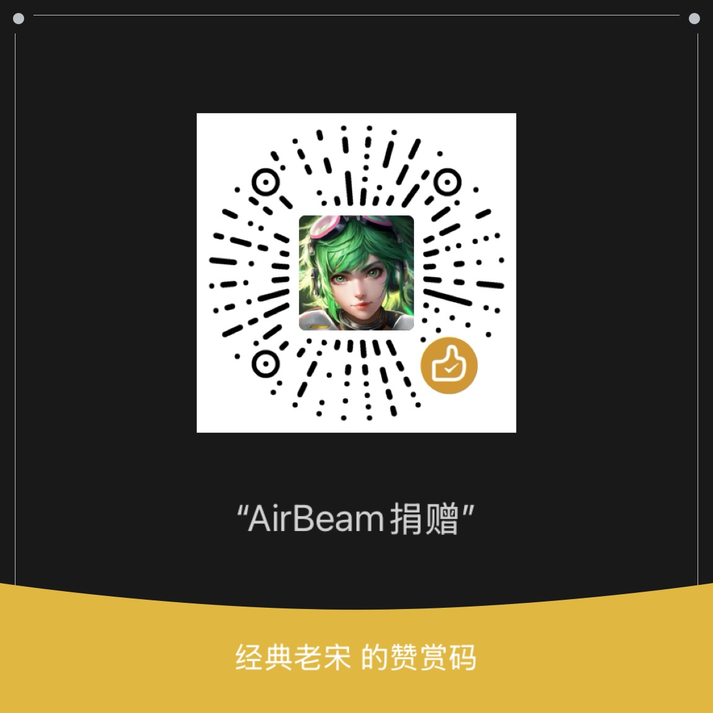

# AirBeam

[English](README.md)

为您的 Android 设备打造的空气鼠标与触摸板。可用于 Miracast/有线投屏，为您的 Android 设备提供近似 DeX 的体验。配合 AR 眼镜效果更佳。独家支持锁屏状态下投屏显示（需要 Android 13+）。

本仓库仅用于提供支持。

[下载](https://github.com/ClassicOldSong/AirBeam/releases)

开发者需要支持以更好地维护与发展此项目。

请扫描以下二维码以支持开发者：

您的支持将同时支持我的其他开源项目，如

- [Apollo](https://github.com/ClassicOldSong/Apollo) - 匹配客户端分辨率全屏串流的极佳选项
- [Artemis](https://github.com/ClassicOldSong/moonlight-android) - Apollo 的 Android 客户端
- [rEFui](https://github.com/SudoMaker/rEFui) - 基于 signal 的高性能前端框架
- [Methanol](https://github.com/SudoMaker/methanol) - 基于 rEFui 和 MDX 的超高性能静态站点生成器。真的非常快，而且非常可自定义。
